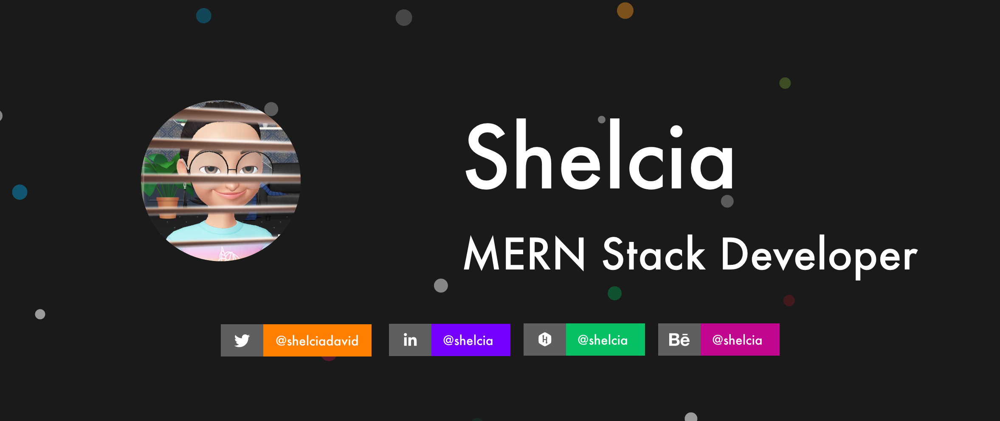

  

# Hello Folks !!!

_** I am a final year engineering student designing and developing web applications since 2018 for fun and to feed my belly. **_

Shelcia is a confident, focus-driven individual. Shelcia has got good experience working as a Web developer with modern tech stacks like MERN and some old good stuff like LAMP, and not to forget the goddess Vanilla JS. Shelcia is often driven by purpose so she is looking forward to being part of something which means a big deal to her. She has good experience working as a Web developer and Designer in startup(s) where she ended up creating web apps. Shelcia loves open source contributions and does freelance occasionally. 

Currently into React Native and Go.

  

# Connect with me

  

# Tools and Languages I have worked with

  

# Github Stats 

# Blog posts
<!-- BLOG-POST-LIST:START -->
- [NodeJs With JWT Authentication](https://medium.com/swlh/nodejs-with-jwt-authentication-feb961763541?source=rss-dd838a6f81c8------2)
- [Build Your First Discord GIF BOT and Deploy](https://medium.com/swlh/build-your-first-discord-gif-bot-and-deploy-2cc917888113?source=rss-dd838a6f81c8------2)
<!-- BLOG-POST-LIST:END -->
